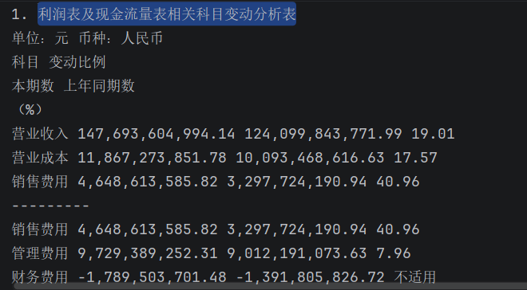
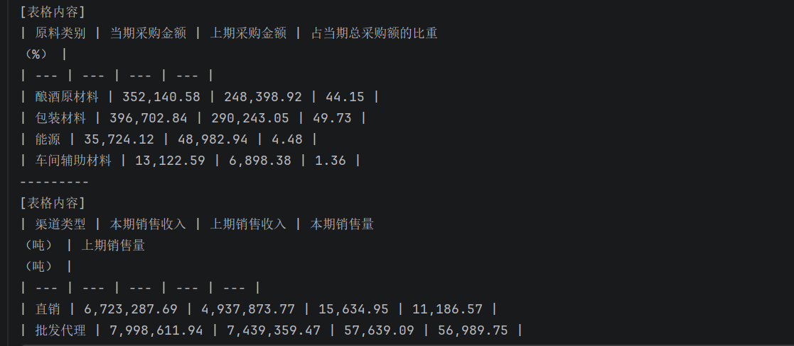

# RAG 智能问答系统（支持表格解析优化）

## 📑 目录
- [项目简介](#项目简介)
- [效果对比](#效果对比)
- [技术栈](#技术栈)
- [如何运行](#如何运行)
- [优化记录](#优化记录)
- [未来计划](#未来计划)
## 项目简介
基于 LangChain + Redis 的本地 PDF 问答系统。通过 RAG 技术让大模型根据文档内容回答问题。  
**亮点**：独立解决了财报 PDF 中表格提取混乱的问题。

## 效果对比
| 修复前（表格行列错乱） | 修复后（结构化文本） |
|----------------------|----------------------|
|  |  |

## 技术栈
- Python 3.10
- LangChain
- pdfplumber
- Redis (向量数据库)
- 阿里云百炼 (embedding + 大模型 API)

## 如何运行
1. 安装依赖：`pip install -r requirements.txt`
2. 启动 Redis 服务（`redis-server`）
3. 配置你的阿里云百炼 API Key（在代码中替换）
4. 运行 `python Indexing索引阶段.py`（构建向量索引）
5. 运行 `python 整合.py`（提问示例）

## 我的优化记录
**问题**：使用 `pdfplumber.extract_text()` 提取财报表格时，数字和文字混在一起，无法检索“营业收入”。  
**解决**：改用 `extract_tables()` 逐行用 `|` 拼接，保留表格结构。  
**结果**：可准确回答“2023年营业收入为 1476.94 亿元”。

## 未来计划
- 支持更多文档类型（Word、图片）
- 添加 Streamlit 前端界面
